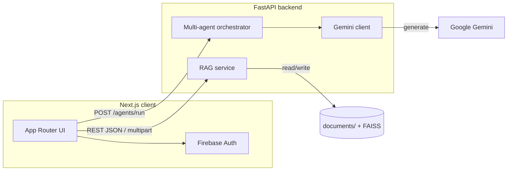

<p align="center">
  
</p>

<h1 align="center">ScholarAI</h1>

<p align="center">
  <strong>AI-assisted studying grounded in your own course materials.</strong><br />
  Upload PDFs and notes, index them per topic, then chat, plan, and quiz with retrieval-augmented answers powered by <strong>FastAPI</strong>, <strong>FAISS</strong>, and <strong>Google Gemini</strong>—all tied to a Firebase-authenticated workspace.
</p>

<p align="center">
  <a href="https://www.python.org/"></a>
  <a href="https://fastapi.tiangolo.com/"></a>
  <a href="https://nextjs.org/"></a>
  <a href="https://firebase.google.com/docs/auth"></a>
</p>

---

## Table of contents

- [Overview](#overview)
- [Features](#features)
- [Architecture](#architecture)
- [Repository layout](#repository-layout)
- [Prerequisites](#prerequisites)
- [Dependencies](#dependencies)
- [Getting started](#getting-started)
- [Configuration](#configuration)
- [HTTP API](#http-api)
- [Data on disk](#data-on-disk)
- [Security considerations](#security-considerations)
- [Development notes](#development-notes)
- [Contributing](#contributing)
- [License](#license)

---

## Overview

ScholarAI is a full-stack study companion for students who want **answers, study plans, and practice questions scoped to their uploads**—not generic web text. Each user selects a **study topic**, uploads supported documents, and the backend builds a **per-topic FAISS vector index** with local embeddings. The web app (Next.js + Tailwind) handles authentication and routes; the API (FastAPI) serves RAG and multi-agent flows backed by **Gemini** for generation.

**Why it exists:** bridge the gap between “chat with an LLM” and “study from *this* syllabus and *these* slides” with a clear topic workflow and file-backed retrieval.

---

## Features

| Area | What you get |
|------|----------------|
| **Authentication** | Email/password and Google sign-in via Firebase; user profile flows where applicable. |
| **Study topics** | One active topic per session; recent topics in history; **remove topic** deletes server-side uploads + index for that label. |
| **Uploads & indexing** | PDF, TXT, Word, PowerPoint → multipart upload, then **rebuild index** for that topic (or combined `__all__` index without `topic`). |
| **File management** | List and delete files per topic; deletes trigger reindexing. |
| **RAG** | Chunking, **sentence-transformers** (`BAAI/bge-small-en`), FAISS (`IndexFlatIP`), JSON sidecar for chunk text. |
| **Agents** | `POST /agents/run` for chat, planner, quiz, evaluation, and plan Q&A with optional RAG context from Gemini. |
| **Product surfaces** | Home hub, Chat, Upload, Planner, Quiz, Privacy, Profile—**topic guard** sends users without a topic back to Home. |

---

## Architecture



- **Frontend:** Next.js (App Router), React, Tailwind CSS, shared API client and study-topic context.
- **Backend:** Single `main.py` application with CORS; `services/` for RAG pipeline; `agents/` for LLM orchestration; `config/settings.py` for environment-driven Gemini settings.

---

## Repository layout

```
ScholarAI-AI-Assistive-Study-Tool/
├── frontend/                 # Next.js (App Router)
│   ├── app/                  # Routes: /, /login, /signup, /profile, /chat, /upload, /planner, /quiz, /privacy, …
│   ├── components/         # UI: Navbar, ChatBox, StudyPlanner, QuizGenerator, UploadZone, …
│   ├── contexts/             # StudyTopicProvider (topic + history per uid)
│   ├── services/             # firebase.ts, api.ts
│   ├── lib/                  # Auth UI helpers, password policy, safe internal paths
│   ├── styles/               # globals.css
│   └── public/               # Static assets (including logo)
├── backend/
│   ├── main.py               # FastAPI: /rag/*, /agents/run, CORS
│   ├── services/             # rag, loader, chunking, embedding, vector_store
│   ├── agents/               # gemini_client, multi_agents
│   ├── documents/            # Runtime uploads + indexes (see .gitignore; .gitkeep only in git)
│   └── requirements.txt
├── config/
│   └── settings.py           # Loads repo-root `.env` (e.g. GEMINI_API_KEY, GEMINI_MODEL)
├── package.json              # Root scripts: dev:frontend, dev:backend, postinstall
└── README.md
```

---

## Prerequisites

| Requirement | Notes |
|---------------|--------|
| **Node.js** | 18+ (LTS recommended) and **npm** |
| **Python** | **3.10+** (3.11/3.12 supported) |
| **Firebase** | Project with **Authentication** (Email/Password + Google) and **Firestore** for the signup user doc |
| **Google AI (Gemini)** | API key for `/agents/run` and any flow using `backend/agents/gemini_client.py` |
| **Disk & network** | First `pip install` pulls **PyTorch** and **FAISS** wheels; first embed download fetches **BAAI/bge-small-en** (~130MB) |

---

## Dependencies

These match what the repository actually imports and runs—not speculative extras.

### Backend (`backend/requirements.txt`)

| Package | Role in this project |
|---------|----------------------|
| **fastapi**, **uvicorn**\[standard\] | REST API server (`main.py`) |
| **python-multipart** | `multipart/form-data` file uploads |
| **python-dotenv** | Loads repo-root `.env` via `config/settings.py` |
| **google-genai** | Gemini client (`from google import genai` in `gemini_client.py`) |
| **pymupdf** | PDF text extraction (`import fitz` in `loader.py`) |
| **python-docx** | `.doc` / `.docx` text in `loader.py` |
| **python-pptx** | `.ppt` / `.pptx` text in `loader.py` |
| **numpy** | Vector math with FAISS (`vector_store.py`) |
| **langchain-text-splitters** | `RecursiveCharacterTextSplitter` in `chunking.py` |
| **sentence-transformers** | Local embeddings model **BAAI/bge-small-en** (`embedding.py`) |
| **torch** | Required runtime for **sentence-transformers** |
| **faiss-cpu** | Per-topic vector index (`vector_store.py`) |

There is **no** Postgres/SQLAlchemy/OpenAI SDK in the current codebase; those were removed from requirements so installs stay aligned with the app.

### Frontend (`frontend/package.json`)

| Package | Role |
|---------|------|
| **next** | App Router, pages, API client host |
| **react**, **react-dom** | UI |
| **firebase** | Auth + Firestore |
| **tailwindcss**, **postcss**, **autoprefixer** | Styling pipeline |
| **typescript** | Types |
| **@types/*** | Type definitions for Node / React |

Install with `cd frontend && npm install` (or `npm run postinstall` from the repo root after `npm install`).

---

## Getting started

Run the API from the **`backend/`** directory so the relative `documents/` path resolves correctly.

### 1. Backend

```bash
cd backend
python -m venv venv
source venv/bin/activate          # Windows: venv\Scripts\activate
pip install -r requirements.txt
```

Create a **`.env` file at the repository root** (same level as `config/`) with at least:

```env
GEMINI_API_KEY=your_key_here
# Optional override:
# GEMINI_MODEL=gemini-2.5-flash
```

Start the server:

```bash
uvicorn main:app --reload --host 0.0.0.0 --port 8000
```

The first indexing run may download the **BAAI/bge-small-en** embedding model (one-time download).

### 2. Frontend

From the repository root (or `frontend/`):

```bash
cd frontend && npm install
```

Create **`frontend/.env.local`**:

```env
NEXT_PUBLIC_API_URL=http://localhost:8000
```

Add your Firebase web configuration in **`frontend/services/firebase.ts`** (from the Firebase console).

```bash
npm run dev
```

Open [http://localhost:3000](http://localhost:3000). After sign-in, users land on **Home** to choose a topic; **Chat**, **Upload**, **Planner**, and **Quiz** are available once a topic is set.

### Monorepo shortcuts (optional)

From the repository root:

| Command | Purpose |
|---------|---------|
| `npm run dev:backend` | Run Uvicorn on port 8000 from `backend/` |
| `npm run dev:frontend` | Run Next.js dev server from `frontend/` |
| `npm run postinstall` | Installs frontend dependencies after root `npm install` |

---

## Configuration

| Concern | Where to configure |
|--------|---------------------|
| API base URL | `frontend/.env.local` → `NEXT_PUBLIC_API_URL` |
| Firebase | `frontend/services/firebase.ts` |
| Gemini API key & model | Repository root `.env`, read by `config/settings.py` (imported from backend/agents) |
| TypeScript paths | `frontend/tsconfig.json` → `baseUrl` + `paths` (`@/*`) |

---

## HTTP API

| Method | Path | Description |
|--------|------|-------------|
| `GET` | `/` | Health check |
| `POST` | `/rag/upload` | Single file upload (`multipart/form-data`: `file`, `topic`, `user_id`) |
| `POST` | `/rag/upload-multiple` | Multiple files + `topic` + `user_id` |
| `POST` | `/rag/index` | Query: `user_id`, optional `topic` — rebuilds FAISS for that topic or `__all__` |
| `POST` | `/rag/query` | JSON body: `question`, `user_id`, optional `topic`, `top_k` — raw chunk retrieval |
| `POST` | `/agents/run` | JSON: `message`, `user_id`, `topic`, optional `mode`, optional `quiz_format` — Gemini + RAG orchestration |
| `GET` | `/rag/files` | Query: `user_id`, `topic` — list uploaded filenames |
| `DELETE` | `/rag/files` | Query: `user_id`, `topic`, `filename` — delete file and reindex |
| `DELETE` | `/rag/topic` | Query: `user_id`, `topic` — delete topic uploads + index directory |

---

## Data on disk

Indexed content and uploads live under:

```
backend/documents/
└── <firebase_uid>/
    ├── uploads/<sanitized_topic>/   # original files
    └── faiss_index/<sanitized_topic>/  # index.faiss, texts.json, …
```

Omitting `topic` on `POST /rag/index` builds a combined index under `faiss_index/__all__/`. The `backend/documents/*` tree is **ignored by git** except `.gitkeep`; do not commit real user data.

---

## Security considerations

- **`user_id` is accepted from the client** on RAG and agent routes. For production, **verify a Firebase ID token** on the server and derive the uid from verified claims instead of trusting the request body alone.
- **CORS** is permissive (`*`) for local development; restrict origins before deploying publicly.
- Keep **`.env` out of version control**; rotate API keys if they are ever exposed.

---

## Development notes

- **Login redirect:** successful auth sends users to **`/`** (home), not back to the login page.
- **Topic guard:** authenticated users without a topic hitting gated routes are redirected to Home (`#choose-topic`).
- **Embeddings:** default path uses local **BAAI/bge-small-en**; no OpenAI key is required for the retrieval pipeline itself.

---

## Contributing

Issues and pull requests are welcome. For larger changes, open an issue first so direction aligns with the project goals. Please keep commits focused and match existing code style.

---

## License

No `LICENSE` file is included in this repository yet. **Add an explicit license** (for example MIT or Apache-2.0) at the root before redistributing or if you need clear terms for contributors.

---

<p align="center">
  <sub>ScholarAI — sign in → choose topic → upload → index → study from <em>your</em> materials.</sub>
</p>
